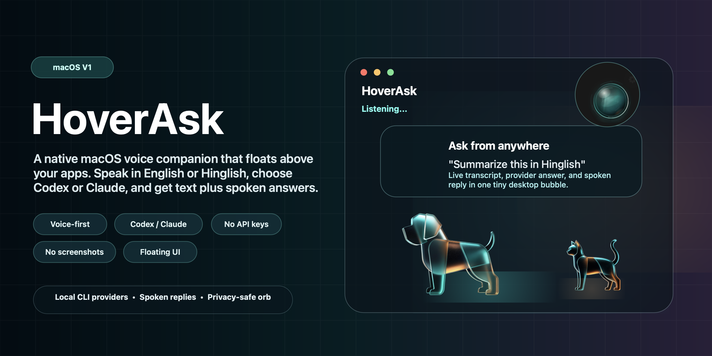

# HoverAsk

<p align="center">
  
</p>

HoverAsk is a native macOS floating voice assistant that sits above other apps. Tap the glass orb or companion, speak in English or Hinglish, and HoverAsk sends the transcribed question to your logged-in local AI CLI account. The answer appears in a compact anchored bubble and can be spoken aloud.

This is a personal/local prototype. It does not use API keys yet, does not capture screenshots, and does not scrape browser content.

## Download

Download the latest macOS build from the GitHub release:

- [HoverAsk-v1.1.0-macos.dmg](https://github.com/arpitagarwal1301/hoverask/releases/download/v1.1.0/HoverAsk-v1.1.0-macos.dmg)
- [HoverAsk v1.1.0 release page](https://github.com/arpitagarwal1301/hoverask/releases/tag/v1.1.0)

Open the DMG, drag `HoverAsk.app` into Applications, then launch it. The app is ad-hoc signed for local testing, not Developer ID notarized yet, so macOS may require right-clicking the app and choosing Open on first launch.

## Features

- Native SwiftUI/AppKit macOS app with a floating always-on-top panel.
- Voice-first question flow using macOS Speech Recognition and microphone input.
- Spoken replies using the built-in macOS speech synthesizer.
- Provider choices: Auto, Codex, Claude, Cursor, OpenCode, or Antigravity when the matching CLI is ready.
- Account-backed execution through local CLIs:
  - `codex exec`
  - `claude -p`
  - `cursor-agent`
  - `opencode`
  - `agy`
- CLI provider status rows with install/info/login affordances.
- Minimal avatars: Glass Orb, Glass Dog, and Glass Cat.
- Privacy-safe refractive glass orb with visible idle/listening rings.
- Optional companion movement: stationary, roam, or chase cursor.
- More readable glass settings, local history size, and incremental history loading.
- BYOK/API-key providers are planned for a future Keychain-backed implementation.

## Requirements

- macOS 14 or newer.
- Xcode Command Line Tools with `swiftc`.
- A logged-in Codex CLI account for Codex provider support.
- A logged-in Claude Code CLI account for Claude provider support.
- Optional logged-in Cursor CLI account for Cursor provider support.
- Optional configured OpenCode CLI for OpenCode provider support.
- Optional Antigravity CLI for Antigravity provider support.
- Microphone and Speech Recognition permissions granted to HoverAsk on first launch.

## Build

```bash
native-swift/HoverAsk/Scripts/build.sh
```

The app is created at:

```bash
outputs/HoverAsk.app
```

Launch it with:

```bash
open outputs/HoverAsk.app
```

## Package DMG

After building the app, create a direct-install DMG with:

```bash
native-swift/HoverAsk/Scripts/package-dmg.sh
```

The DMG is created at:

```bash
outputs/HoverAsk-v1.1.0-macos.dmg
```

## Provider Auth

HoverAsk does not ask for API keys in this build. It shells out to locally installed CLIs that are already logged in.

For Codex, install and log in to the Codex CLI, then verify:

```bash
codex --version
```

For Claude, install and log in to Claude Code, then verify:

```bash
claude --version
```

Optional providers:

```bash
cursor-agent --version
opencode --version
agy --version
```

Only ready providers appear in the provider picker. `Auto` tries ready providers in this order: Codex, Claude, Cursor, OpenCode, then Antigravity.

Google Gemini CLI is not exposed as a runnable CLI provider for individual account sign-in. Gemini is planned for the future BYOK implementation, where keys will be stored in macOS Keychain.

## Usage

1. Open HoverAsk.
2. Tap the orb or companion.
3. Speak a question in English or Hinglish.
4. Watch the live transcript bubble.
5. HoverAsk sends the final transcript to the selected provider.
6. Read and optionally hear the answer.

The status menu includes show/hide, settings, and quit controls.

## Privacy

- No screenshots or screen content are captured.
- No browser scraping is performed.
- No API keys are collected in this build.
- Prompts are sent only to the selected local CLI provider process.
- Settings and optional history are stored locally under the user's Application Support directory.

See [PRIVACY.md](PRIVACY.md) for details.

## Third-Party Notices

HoverAsk includes MIT-licensed Lockpaw visual assets for the Glass Dog and Glass Cat companions. See [THIRD_PARTY_NOTICES.md](THIRD_PARTY_NOTICES.md).

## Release Status

The current release is published for evaluation while branding, assets, and distribution decisions remain under review. HoverAsk is proprietary software; see [LICENSE](LICENSE).

## GitHub Visuals

The repository preview artwork lives at [docs/assets/hoverask-v1-final-preview.png](docs/assets/hoverask-v1-final-preview.png). Use it for GitHub's Social preview image so the project is recognizable when shared.
