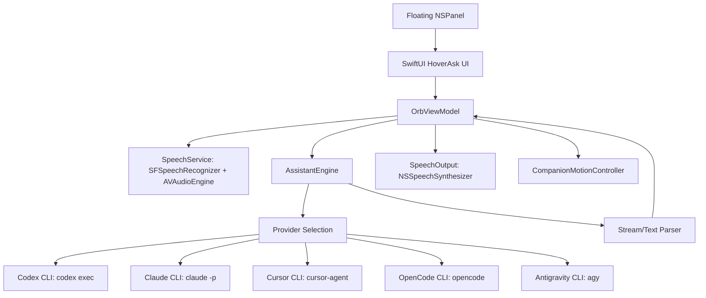

# HoverAsk Architecture

HoverAsk is a native macOS app built with Swift, SwiftUI, AppKit, Speech, AVFoundation, and Carbon hotkeys.



## App Shell

- `NSPanel` uses a transparent borderless window.
- The panel is set above normal app windows and joins all Spaces.
- SwiftUI renders the refractive glass avatar, visible orb rings, transcript bubble, answer bubble, and settings panel.
- Dragging is handled through the floating panel and pauses companion motion briefly.

## Voice Pipeline

- `SpeechService` starts microphone capture through `AVAudioEngine`.
- `SFSpeechRecognizer` emits partial transcripts for the live bubble.
- Silence or manual stop submits the final transcript.
- `SpeechOutput` uses `NSSpeechSynthesizer` for spoken replies when enabled.

## Provider Engine

HoverAsk keeps the provider boundary local and account-backed.

Codex command shape:

```bash
codex exec --ephemeral --skip-git-repo-check --sandbox read-only --color never --json
```

Claude command shape:

```bash
claude -p --output-format stream-json --verbose --include-partial-messages --no-session-persistence --permission-mode dontAsk
```

Additional CLI command shapes:

```bash
cursor-agent --print --mode ask --output-format text --trust --workspace <runtimeDirectory> <prompt>
opencode run --agent plan --dir <runtimeDirectory> <prompt>
agy -p <prompt>
```

Provider selection supports:

- `Auto`: ready providers in Codex, Claude, Cursor, OpenCode, Antigravity order.
- `Codex`: Codex only.
- `Claude`: Claude only.
- `Cursor`: Cursor only when ready.
- `OpenCode`: OpenCode only when ready.
- `Antigravity`: Antigravity only when ready.

## Local State

- Settings are persisted with `UserDefaults`.
- Optional history is stored in Application Support under `HoverAsk`.
- Provider runtime files are isolated under `HoverAsk/assistant-runtime`.

## Current Boundaries

- No screenshots.
- No browser scraping.
- No API keys in the current release.
- No remote backend owned by HoverAsk.
- The orb lens effect is drawn locally and does not sample or magnify real desktop pixels.
