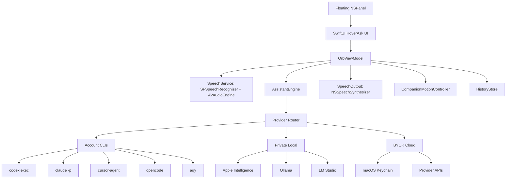

# HoverAsk Architecture

HoverAsk is a native macOS app built with Swift, SwiftUI, AppKit, Speech, AVFoundation, Carbon hotkeys, and Security/Keychain APIs.



## App Shell

- HoverAsk runs as a transparent floating `NSPanel` above normal app windows and across Spaces.
- SwiftUI renders the glass avatar, anchored chat chip, settings window, provider controls, and local history views.
- Dragging the avatar moves the panel and temporarily pauses companion motion.

## Voice Pipeline

- `SpeechService` uses `AVAudioEngine` for microphone capture and `SFSpeechRecognizer` for partial and final transcripts.
- Voice input waits for silence before submitting the current transcript.
- Typing can be used alongside voice and can stop active listening.
- `SpeechOutput` uses `NSSpeechSynthesizer` for spoken replies when enabled.

## Provider Engine

`AssistantEngine` routes each prompt through a selected provider or through `Auto`. Auto uses the persisted fallback order from settings, skipping disabled or unavailable providers.

Provider groups:

- `CLI`: Codex, Claude, Cursor, OpenCode, Antigravity.
- `Local`: Apple Intelligence, Ollama, LM Studio.
- `BYOK`: OpenAI, Anthropic, Gemini, OpenRouter, Groq.

CLI command shapes:

```bash
codex exec --ephemeral --skip-git-repo-check --sandbox read-only --color never --json -
claude -p --output-format stream-json --verbose --include-partial-messages --no-session-persistence --permission-mode dontAsk <prompt>
cursor-agent --print --mode ask --output-format text --trust --workspace <runtimeDirectory> <prompt>
opencode run --agent plan --dir <runtimeDirectory> <prompt>
agy -p <prompt>
```

Local and BYOK routes use provider-specific adapters:

- Apple Intelligence is detected at runtime and uses Apple defaults when available.
- Ollama uses `localhost:11434`.
- LM Studio uses `localhost:1234`.
- BYOK providers use native provider APIs or OpenAI-compatible endpoints, with selected model IDs stored in settings and API keys stored only in Keychain.

## Local State

- App settings are stored with `UserDefaults`.
- Optional chat history is stored locally in Application Support under `HoverAsk`.
- Provider runtime files live under `HoverAsk/assistant-runtime`.
- BYOK keys are stored in macOS Keychain under service `app.hoverask.byok`, one Keychain account per provider.

## Distribution

- Version source of truth: `native-swift/HoverAsk/Resources/Info.plist` -> `CFBundleShortVersionString`.
- Build output: `outputs/HoverAsk.app`.
- Release artifacts: `outputs/HoverAsk-v<version>-macos.pkg` and `outputs/HoverAsk-v<version>-macos.dmg`.
- Homebrew distribution lives in the separate `arpitagarwal1301/homebrew-tap` repo as `Casks/hoverask.rb`.

## Current Boundaries

- No screenshots or screen recording.
- No browser scraping or page reading.
- No HoverAsk-owned remote backend.
- BYOK keys are never written to `UserDefaults`, history, docs, diagnostics, or plain files.
- The orb lens effect is drawn locally and does not sample or magnify real desktop pixels.
